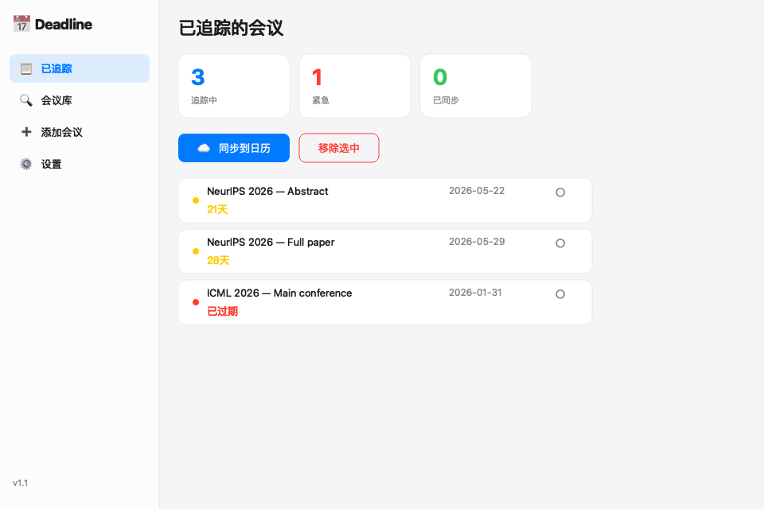

<div align="center">

# 📅 Deadline Tracker

**CS / Robotics / AI 顶会截稿日期管理器**

一个 macOS 桌面应用，帮你追踪学术会议的截稿日期，再也不错过任何 Deadline！

[](https://python.org)
[](https://www.riverbankcomputing.com/software/pyqt/)
[](https://apple.com)
[](#license)



</div>

---

## ✨ 功能特性

| 功能 | 描述 |
|------|------|
| 📋 **会议追踪** | 一键添加 CS/AI/Robotics/NLP 顶会截稿日期 |
| 🗓️ **日历同步** | 自动同步到 macOS Calendar，附带提前提醒 |
| ✅ **提醒事项** | 同步到 Apple Reminders，DDL 之前自动提醒 |
| 🔍 **会议库浏览** | 内置 20+ 顶会数据库，按分类筛选搜索 |
| ➕ **自定义添加** | 支持手动添加任何会议/期刊的截稿日期 |
| 🎨 **Apple 风格** | macOS 原生设计，侧边栏导航、卡片式布局 |
| ⏰ **到期提醒** | 启动时自动检查近期截稿，颜色标注紧急程度 |
| 🧩 **桌面小组件** | 轻量级桌面悬浮组件，随时查看倒计时 |

## 🚀 快速开始

### 方式一：DMG 安装（推荐）

1. 前往 [Releases](https://github.com/JIAlonglong/DeadlineTracker/releases) 下载 `DeadlineTracker.dmg`
2. 双击打开 DMG，将 `Deadline Tracker` 拖入「应用程序」
3. 在启动台或应用程序文件夹中打开

### 方式二：源码运行

```bash
# 克隆项目
git clone https://github.com/JIAlonglong/DeadlineTracker.git
cd DeadlineTracker

# 创建虚拟环境
python3 -m venv venv
source venv/bin/activate

# 安装依赖
pip install -r requirements.txt

# 运行完整应用
python3 main.py --app

# 或运行桌面小组件
python3 main.py
```

## 📂 项目结构

```
DeadlineTracker/
├── main.py              # 程序入口（支持 --widget / --app 模式）
├── ui_main.py           # PyQt6 Apple 风格界面
├── widget.py            # 桌面小组件
├── conferences.py       # 会议截稿日期数据库（20+ 顶会）
├── config_manager.py    # 用户配置管理（JSON 持久化）
├── apple_integration.py # macOS Calendar & Reminders 集成
├── setup.py             # py2app 打包配置
├── requirements.txt     # Python 依赖
├── launch.sh            # 启动脚本
└── assets/              # 资源文件
```

## 📊 内置会议数据库

### 🤖 ML / AI
| 缩写 | 全称 | 典型截稿月份 |
|------|------|-------------|
| NeurIPS | Neural Information Processing Systems | 5月 |
| ICML | International Conference on Machine Learning | 1月 |
| ICLR | International Conference on Learning Representations | 10月 |
| AAAI | AAAI Conference on Artificial Intelligence | 8月 |
| IJCAI | International Joint Conference on AI | 1月 |

### 👁️ 计算机视觉
| 缩写 | 全称 | 典型截稿月份 |
|------|------|-------------|
| CVPR | Computer Vision and Pattern Recognition | 11月 |
| ICCV | International Conference on Computer Vision | 3月 |
| ECCV | European Conference on Computer Vision | 3月 |

### 🤖 机器人学
| 缩写 | 全称 | 典型截稿月份 |
|------|------|-------------|
| ICRA | IEEE Int. Conf. on Robotics and Automation | 9月 |
| IROS | IEEE/RSJ Int. Conf. on Intelligent Robots | 3月 |
| RSS | Robotics: Science and Systems | 2月 |
| CoRL | Conf. on Robot Learning | 6月 |

### 📝 自然语言处理
| 缩写 | 全称 | 典型截稿月份 |
|------|------|-------------|
| ACL | Association for Computational Linguistics | 1月 |
| EMNLP | Empirical Methods in NLP | 6月 |
| NAACL | North American Chapter of ACL | 10月 |

### 📰 顶级期刊
| 缩写 | 全称 | 投稿方式 |
|------|------|---------|
| T-PAMI | IEEE Trans. on Pattern Analysis and Machine Intelligence | 滚动投稿 |
| T-RO | IEEE Trans. on Robotics | 滚动投稿 |
| IJRR | Int. Journal of Robotics Research | 滚动投稿 |
| JMLR | Journal of Machine Learning Research | 滚动投稿 |
| Nature MI | Nature Machine Intelligence | 滚动投稿 |

## 🛠️ 使用说明

1. **浏览会议库** → 在「会议库」标签中搜索感兴趣的会议
2. **添加追踪** → 点击「追踪」按钮，截稿日期自动加入列表
3. **同步日历** → 点击「☁️ 同步到日历」，一键同步到 Apple Calendar
4. **手动添加** → 在「添加会议」标签中输入自定义截稿信息
5. **设置** → 配置提前提醒天数、日历名称等偏好

## 🤝 贡献

欢迎提交 Issue 和 Pull Request！

1. Fork 本项目
2. 创建你的特性分支 (`git checkout -b feature/amazing-feature`)
3. 提交你的改动 (`git commit -m 'Add amazing feature'`)
4. 推送到分支 (`git push origin feature/amazing-feature`)
5. 打开一个 Pull Request

## 📝 数据说明

> 会议截稿日期基于往年典型时间，每年可能会有微调。建议定期关注各会议官网获取最新信息。

## 📄 License

本项目采用 [MIT License](LICENSE) 开源。

---

<div align="center">

**⭐ 如果这个项目对你有帮助，请给个 Star 支持一下！**

Made with ❤️ by [JIAlonglong](https://github.com/JIAlonglong)

</div>
